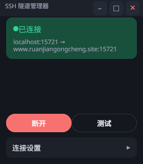

# SSH 隧道管理器

一个小型跨桌面应用，用 Go + [Gio](https://gioui.org) 编写，管理 SSH
本地/远程端口转发。以托盘应用方式运行：托盘图标反映隧道状态，菜单
提供连接、断开和恢复窗口的操作。



## 功能

- 通过普通 `ssh` 进程进行本地（`-L`）和远程（`-R`）端口转发，因此
  现有的 known_hosts/agent 配置仍然有效
- 连接时的 DDNS 快速路径：若存在 `baidu.key`，服务器 IP 通过百度云
  DNS API 获取（权威解析，绕过本地过期的 resolver 缓存），随后刷新
  操作系统 DNS 缓存；否则直接查询 `settings.dns_resolver`（默认
  `119.29.29.29`）。两条路径都会把解析到的 IP 直接交给 ssh 连接，
  隧道不再依赖第二次可能过期的本地解析。心跳（默认 15 秒，可通过
  `settings.ddns_check_interval` 调整）在 IP 变化时自动重启隧道，
  无 `baidu.key` 时同样生效
- 可选的域名解析优化（Linux/桌面端）：在设置页面一键安装
  systemd-resolved drop-in（通过 pkexec 密码提示），将转发域名的解析
  路由到其权威 nameserver，使本地工具如 ping/curl 解析到最新地址，
  而非 ISP 缓存的过期记录
- 状态卡片，显示实时隧道状态和转发地址
- 端口冲突对话框（杀死进程 / 更换端口 / 忽略）
- 连接设置收起在主页面中；配置以 JSON 存储，SSH 密码经过
  AES-256-GCM 加密
- 自定义极简标题栏（最小化 / 最大化 / 关闭，可拖拽）
- 托盘图标按状态变色 + 实时状态和连接/断开菜单；单实例：再次
  启动可恢复窗口
- 自动重连，带重试次数限制和进程监控

## 构建与运行

要求：Go 1.26+，`PATH` 中有 SSH 客户端，若使用密码认证还需
`sshpass`（密钥认证同样可用）。

在干净的 Linux 机器上，Gio 的 CGO 后端还需要图形开发头文件
（Ubuntu/Debian 包名）：

```sh
sudo apt install build-essential pkg-config \
    libx11-dev libxkbcommon-dev libxkbcommon-x11-dev \
    libwayland-dev libegl1-mesa-dev libgles2-mesa-dev
```

```sh
make build            # Linux 二进制 -> build/ssh-tunnel-manager
make build-windows    # Windows 二进制 -> build/ssh-tunnel-manager.exe
make test
./build/ssh-tunnel-manager
```

Windows 构建为 best-effort：单实例锁、端口占用的进程识别与结束、
域名解析优化均依赖 Linux 工具（flock/unix socket、ss/fuser/lsof、
pkexec + resolvectl），在 Windows 上不可用或降级。

构建时将版本号（git describe）注入二进制；设置页面会显示它。可选的
运行时辅助程序会被自动检测：`pkexec` + `resolvectl` 驱动设置中的
域名解析优化行。

### 桌面集成（可选，Linux）

```sh
sudo make install     # 二进制 -> /usr/local/bin + 菜单项 + 图标
```

此后应用从桌面菜单启动，带自己的图标。卸载方式：删除
`/usr/local/bin/ssh-tunnel-manager`、`/usr/local/bin/querydns`，以及
`/usr/local/share/applications/` 和 `/usr/local/share/icons/` 下的
ssh-tunnel-manager 条目。

## 配置

应用只管理一条转发规则。配置保存在
`~/.config/ssh-tunnel-manager/config.json`；存储的 SSH
密码的加密密钥单独保存在
`~/.local/share/ssh-tunnel-manager/secret.key`，这样配置备份不会
携带它。首次运行时两者都会从旧的可执行目录布局自动迁移。日志写入
每用户的缓存目录。旧版本（多转发列表格式）的 `config.json`
在加载时会自动迁移：保留第一条转发规则，其余丢弃。

已提交一个带占位值的模板 `config.example.json`。将其复制为
`config.json`（首次运行时会自动创建），并在连接前编辑其中的值。
`settings.api_key` 是通过隧道发送的 Anthropic API 密钥，由应用内的
测试按钮使用（可选）。注意：SSH 密码字段留空表示“保留已存密码”，
因此一旦设置密码就无法通过界面清除——如需清除，请编辑或删除
`config.json` 中的对应字段。

当 `baidu.key` 存在时，应用使用百度云 DNS API 解析转发的主机名；
当其不存在时，回退到 `settings.dns_resolver` 中的 DNS 服务器
（默认 `119.29.29.29`，百度公共 DNS），而不是本地系统 resolver，
因为对于 DDNS 主机，本地缓存正是我们要避免的过期记录。将
`settings.dns_resolver` 设为空字符串以使用系统 resolver。

## 项目布局

| 路径 | 内容 |
|---|---|
| `main.go` | 应用生命周期：单实例、托盘接线、窗口循环 |
| `ui.go` + `page_*.go`、`titlebar.go`、`theme.go`、`dialog_conflict.go` | Gio UI |
| `ssh.go` | 隧道进程管理、状态转换、重连 |
| `config.go` / `crypto.go` / `logger.go` / `paths.go` | 配置持久化、密码加密、日志、文件位置 |
| `tray.go` | 托盘图标/菜单（fyne.io/systray） |
| `cmd/querydns` | 独立 CLI：导出某个 zone 的百度云 DNS 记录（读取 `baidu.key`） |
| `third_party/gio` | 内嵌 Gio，含本地补丁 —— 参见 `PATCHES.md` |